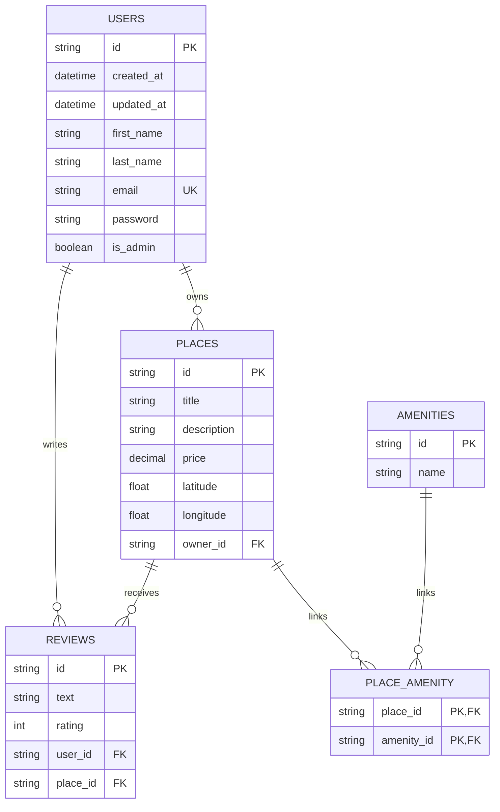

# HBnB Part 3 - Entity Relationship Diagram

This diagram represents the database structure defined in the SQL script for Part 3 of the HBnB project.

Important note:
- This exercise is based on the raw SQL schema.
- The diagram below follows `sql/schema.sql` exactly.
- In that script, the foreign key in `places` is named `owner_id`.

Source used for this diagram:
- `part3/hbnb/sql/schema.sql`

## Relationship summary

- One user can own many places.
- One user can write many reviews.
- One place can receive many reviews.
- One place can have many amenities.
- One amenity can belong to many places.
- The many-to-many relation between places and amenities is implemented through `place_amenity`.

## Constraints to mention during the presentation

- `users.email` must be unique.
- `amenities.name` must be unique.
- `reviews.rating` must stay between 1 and 5.
- A review belongs to exactly one user and one place.
- The pair `(user_id, place_id)` is unique in the SQL script, which prevents a user from reviewing the same place twice.

## Short presentation script

You can explain the diagram like this:

"The schema is built around five tables: users, places, reviews, amenities, and place_amenity. A user can own several places through the owner_id foreign key. A user can also write several reviews, and each review is linked to one place. The many-to-many relationship between places and amenities is handled by the place_amenity table. This structure ensures data consistency and makes relationships easy to query in SQL." 